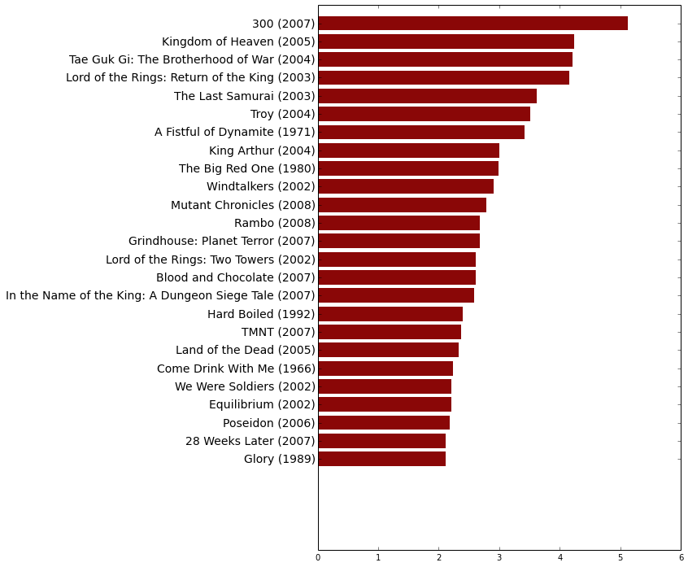
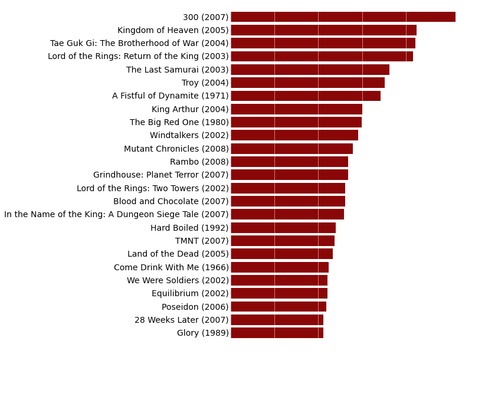
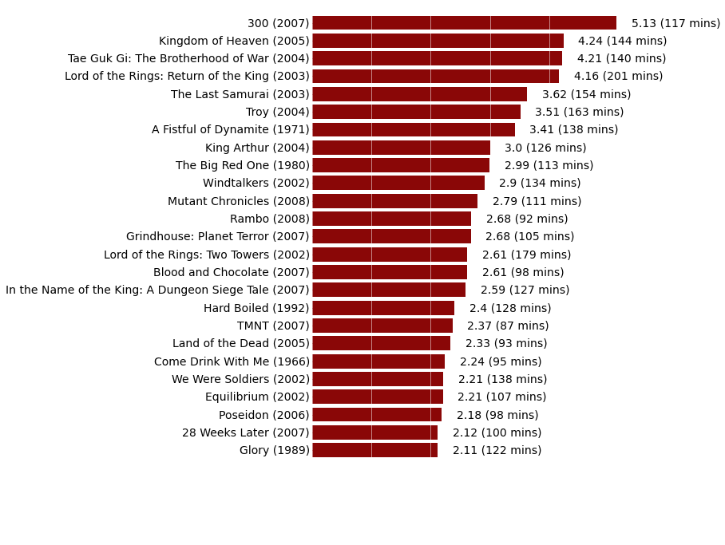

**Document title:** R vs Python - Round 1

**Date:** January 5, 2014

**Text by:** Simon Garnier ([www.theswarmlab.com](http://www.theswarmlab.com)
/ [\@sjmgarnier](http://twitter.com/sjmgarnier))

**R code by:** Simon Garnier
([www.theswarmlab.com](http://www.theswarmlab.com) /
[\@sjmgarnier](http://twitter.com/sjmgarnier))

**Python code by:** Randy Olson
([www.randalolson.com](http://www.randalolson.com) /
[\@randal_olson](http://twitter.com/randal_olson))

Document generated with RStudio ([www.rstudio.com](http://www.rstudio.com)), 
knitr ([www.yihui.name/knitr/](http://yihui.name/knitr/)) and pandoc 
([www.johnmacfarlane.net/pandoc/](http://johnmacfarlane.net/pandoc/)). Python
figures generated with iPython Notebook
([www.ipython.org/notebook.html](http://ipython.org/notebook.html)).

___

#### Foreword ####

My friend Randy Olson and I got into the habit to argue about the relative 
qualities of our favorite languages for data analysis and visualization. I am
an enthusiastic R user ([www.r-project.org](http://www.r-project.org)) while 
Randy is a fan of Python ([www.python.org](http://www.python.org)). One thing
we agree on however is that our discussions are meaningless unless we
actually put R and Python to a series of tests to showcase their relative
strengths and weaknesses. Essentially we will set a common goal (*e.g.*,
perform a particular type of data analysis or draw a particular type of
graph) and create the R and Python codes to achieve this goal. And since
Randy and I are all about sharing, open source and open access, we decided to
make public the results of our friendly challenges so that you can help us
decide between R and Python and, hopefully, also learn something along the
way.

___

#### Today's challenge: where we learn that Hollywood's cemetery is full ####

##### 1 - Introduction #####

For this first challenge, we will use data collected by Randy for his recent
post on the ["Top 25 most violence packed films" in the history of the movie
industry](www.randalolson.com/2013/12/31/most-violence-packed-films/). For
his post, Randy generated a simple horizontal barchart showing the top 25
more violent films ordered by number of on screen deaths per minute. In the
rest of this document, we will show you how to reproduce this graph using
Python and how to achieve a similar result with R. We will detail the
different steps of the process and provide for each step the corresponding
code (red boxes for R, green boxes for Python). You will also find the entire
codes at the end of this document.

And now without further ado, let's get started!

##### 2 - Step by step process #####

First thing first, let's set up our working environment by loading some
necessary libraries.


```r
# Load libraries
library(lattice)        # Very versatile graphics package
library(latticeExtra)   # Addition to "lattice" that makes layering graphs a 
                        # breathe, and I'm a lazy person, so why not
```

```python
# This starts the IPython Notebook pylab module, useful for plotting and
# interactive scientific computing
%pylab inline
from pandas import *
```


Now let's load the data for today's job. The raw data were scraped by Randy 
(using Python) from [www.MovieBodyCounts.com](http://www.MovieBodyCounts.com)
and he generously provided the result of his hard work on FigShare at this 
address: 
[http://dx.doi.org/10.6084/m9.figshare.889719](http://dx.doi.org/10.6084/m9.figshare.889719).


```r
# Load data into a data frame
body.count.data <- read.csv("http://files.figshare.com/1332945/film_death_counts.csv")
```

```python
# Read the data into a pandas DataFrame
body_count_data = read_csv("http://files.figshare.com/1332945/film_death_counts.csv")
```


For each movie, the data frame contains a column for the total number of on
screen deaths ("Body_Count") and a column for the duration
("Length_Minutes"). We will now create an extra column for the number of on
screen deaths per minute of each movie ("Deaths_Per_Minute")


```r
# Compute on screen deaths per minute for each movie. 
body.count.data <- within(body.count.data, { 
  Deaths_Per_Minute <- Body_Count / Length_Minutes
  ord <- order(Deaths_Per_Minute, decreasing = TRUE)  # useful later
})
```

```python
# Divide the body counts by the length of the film
body_count_data["Deaths_Per_Minute"] = (body_count_data["Body_Count"].apply(float).values /
                                          body_count_data["Length_Minutes"].values)
```


Now we will reorder the data frame by (descending) number of on screen deaths
per minute, and select the top 25 most violent movies according to this criterion.


```r
# Reorder "body.count.data" by (descending) number of on screen deaths per minute
body.count.data <- body.count.data[body.count.data$ord, ]

# Select top 25 most violent movies by number of on screen deaths per minute
body.count.data <- body.count.data[1:25,]
```

```python
# Only keep the top 25 highest kills per minute films
body_count_data = body_count_data.sort("Deaths_Per_Minute", ascending=False)[:25]

# Change the order of the data so highest kills per minute films are on top in the plot
body_count_data = body_count_data.sort("Deaths_Per_Minute", ascending=True)
```


In Randy's graph, the "y" axis shows the film title with the release date. We
will now generate the full title for each movie following a "Movie name
(year)" format, and append it to the data frame.


```r
# Combine film title and release date into a new factor column with levels
# ordered by ascending violence
body.count.data <- within(body.count.data, {
  Full_Title <- paste0(Film, " (", Year, ")")
  ord <- order(Deaths_Per_Minute, decreasing = TRUE)
  Full_Title <- ordered(Full_Title, levels = rev(unique(Full_Title[ord])))  # some films are duplicated! Bad Randy!
})
```

```python
# Generate the full titles for the movies: movie name (year)
full_title = []

for film, year in zip(body_count_data["Film"].values, body_count_data["Year"].values):
  full_title.append(film + " (" + str(year) + ")")

body_count_ y-axis ticks on the left and x-axis ticks on the bottom
ax.yaxis.tick_left()
ax.xaxis.tick_bottom()data["Full_Title"] = array(full_title)
```


Now we are ready to generate the barchart. We're going to start with the
default options and then we will make this thing look pretty.


```r
# Generate base graph
graph <- barchart(Full_Title ~ Deaths_Per_Minute, data = body.count.data)
print(graph)
```


```python
# plot the bars
fig = plt.figure(figsize=(8,12))

# Plot the red horizontal bars
rects = plt.barh(range(len(body_count_data["Deaths_Per_Minute"])),
                 body_count_data["Deaths_Per_Minute"],
                 height=0.8,
                 align="center",
                 color="#8A0707",
                 edgecolor="none")

# Add the film labels to left of the bars (y-axis)
yticks(range(len(body_count_data["Full_Title"])), body_count_data["Full_Title"].values, fontsize=14)xticks(arange(0, 5, 1), [""])
```


<center>  </center>

Ok, now let's make this pretty. 


```r
# Create theme
my.bloody.theme <- within(trellis.par.get(), {    # Initialize theme with default value
  axis.line$col <- NA                             # Remove axes 
  plot.polygon <- within(plot.polygon, {
    col <- "#8A0606"                              # Set bar colors to a nice bloody red
    border <- NA                                  # Remove bars' outline
  })
  axis.text$cex <- 1                              # Default axis text size is a bit small. Make it bigger
  layout.heights <- within(layout.heights, {
    bottom.padding <- 0                           # Remove bottom padding
    axis.bottom <- 0                              # Remove axis padding at the bottom of the graph
    axis.top <- 0                                 # Remove axis padding at the top of the graph
  })
})

# Update figure with new theme + other improvements (like a title for instance)
graph <- update(
  graph, 
  main='25 most violence packed films by deaths per minute',    # Title of the barchart
  par.settings = my.bloody.theme,                               # Use custom theme
  xlab = NULL,                                                  # Remove label of x axis
  scales=list(x=list(at=NULL)),                                 # Remove rest of x axis
  xlim = c(0, 6.7),                                             # Set graph limits along x axis to accomodate the additional text (requires some trial and error)
  box.width=0.75)                                               # Default bar width is a bit small. Make it bigger)

print(graph)
```


```python
# Don't have any x tick labels
xticks(arange(0, 5, 1), [""])

# Plot styling

# Remove the plot frame lines
ax = axes()
ax.spines["top"].set_visible(False)
ax.spines["right"].set_visible(False)
ax.spines["left"].set_visible(False)
ax.spines["bottom"].set_visible(False)

# Color the y-axis ticks the same dark red color, and the x-axis ticks white
ax.tick_params(axis="y", color="#8A0707")
ax.tick_params(axis="x", color="white")

ax.xaxis.grid(color="white", linestyle="-")
```


<center>  </center>

Finally, the last thing we want to add to our graph is the number of deaths
per minute and the duration of each movie on the right of the graph.


```r
# Combine number of on screen death per minute and duration of the movies into a new character string column
body.count.data <- within(body.count.data, {
  Deaths_Per_Minute_With_Length = paste0(round(body.count.data$Deaths_Per_Minute, digits=2), " (", body.count.data$Length_Minutes, " mins)")
})

# Add number of on screen deaths per minute and duration of movies at the end of each bar 
graph <- graph + layer(with(body.count.data, 
  panel.text(
    Deaths_Per_Minute,                  # x position of the text
    25:1,                               # y position of the text
    pos = 4,                            # Position of the text relative to the x and y position (4 = to the right)
    Deaths_Per_Minute_With_Length)))    # Text to display                                     

# Print graph
print(graph)
```


```python
# This function adds the deaths per minute label to the right of the bars
def autolabel(rects):
  for i, rect in enumerate(rects):
  width = rect.get_width()
label_text = (str(round(float(width), 2)) +
                " (" + str(body_count_data["Length_Minutes"].values[i]) +
                " mins)")

plt.text(width + 0.25,
         rect.get_y() + rect.get_height() / 2.,
         label_text,
         ha="left",
         va="center",
         fontsize=14)

autolabel(rects)
```


<center>  </center>

___

#### 3 - R bonus ####

Just for fun, I decided to add to the R graph a little accessory in relation
with the general theme of this data set.


```r
# Load additional libraries
library(jpeg)  # To read JPG images
library(grid)  # Graphics library with better image plotting capabilities

# Download a pretty background image; mode is set to "wb" because it seems that
# Windows needs it. I don't use Windows, I can't confirm
download.file(url = "http://www.theswarmlab.com/wp-content/uploads/2014/01/bloody_gun.jpg", 
              destfile = "bloody_gun.jpg", quiet = TRUE, mode = "wb")

# Load gun image using "readJPEG" from the "jpeg" package
img <- readJPEG("bloody_gun.jpg")

# Add image to graph using "grid.raster" from the "grid" package
graph <- graph + layer_(
  grid.raster(
    as.raster(img),                 # Image as a raster
    x = 1,                          # x location of image "Normalised Parent Coordinates"
    y = 0,                          # y location of image "Normalised Parent Coordinates"
    height = 0.7,                   # Height of the image. 1 indicates that the image height is equal to the graph height
    just = c("right", "bottom")))   # Justification of the image relative to its x and y locations

# Print graph
print(graph)
```


___

#### 4 - Source code ####

R and Python source codes are available 
[here](https://github.com/morpionZ/R-vs-Python/tree/master/Deadliest%20movies/code).

For F# fan, [Terje Tyldum](http://terjetyl.ghost.io/) has written his version
of the code in F# [here](http://terjetyl.ghost.io/f-charting-challenge/).

Randy and I also recommend that you check out [this 
post](http://nbviewer.ipython.org/github/yaph/ipython-notebooks/blob/master/Exploring%20Movie%20Body%20Counts.ipynb)
by [Ramiro Gómez](http://ramiro.org/) ([\@yaph](https://twitter.com/yaph)) 
where he does a more in-depth analysis of the data set we used for today’s 
challenge.

